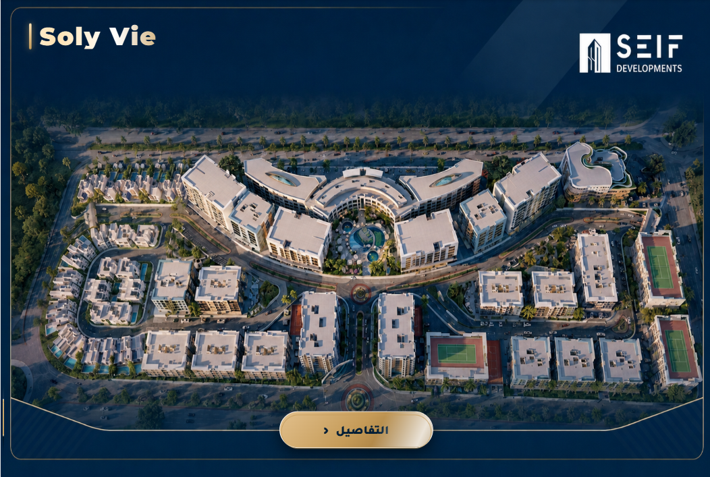
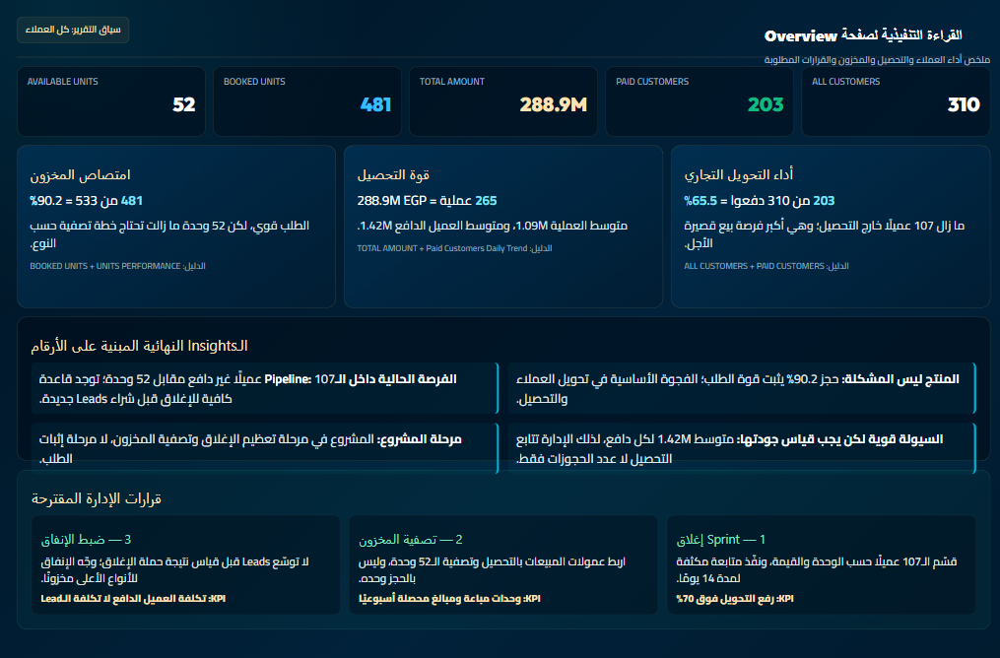
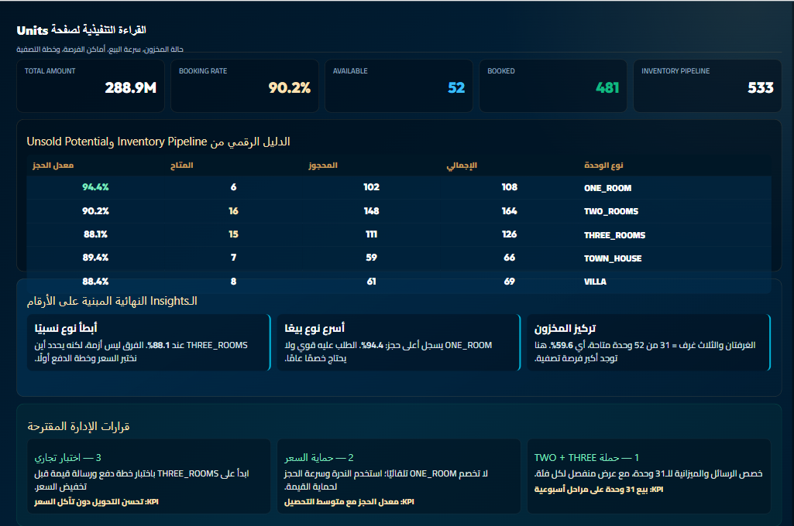
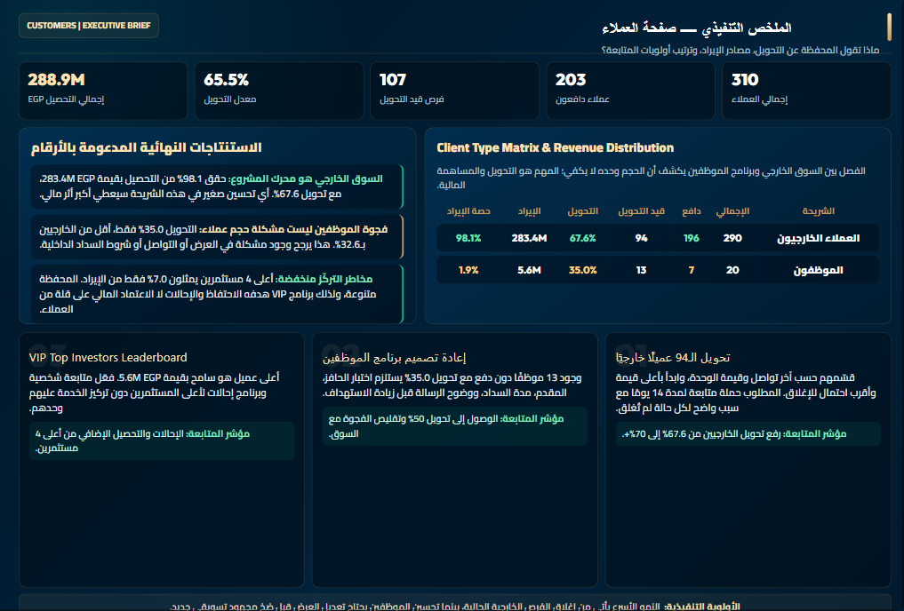

# Soly Vie Real Estate Analytics

**A Power BI decision story built around one uncomfortable question: are strong bookings actually turning into cash?**

At first glance, a **90.2% booking rate** looked like a clear success. But when I placed it beside a **65.5% customer conversion rate**, the story changed. The real opportunity was no longer simply “sell more units.” It was to convert the existing pipeline, protect pricing where demand is strongest, and release the value still tied up in available inventory.

## The management view

This report connects three parts of the same commercial story:

- **Demand:** 481 of 533 units are booked.
- **Cash conversion:** 203 of 310 customers have paid.
- **Remaining opportunity:** 52 units still represent **32.6M EGP** in potential revenue.

Instead of treating those numbers as separate KPIs, the dashboard turns them into a sequence of decisions: close the current customer pipeline, focus inventory action by unit type, and use different follow-up strategies for external customers and employees.

## 1. Executive Overview — where performance meets the pipeline

The overview confirms that demand is strong: **481 units are booked out of 533**, producing a **90.2% booking rate**. The portfolio records **288.9M EGP** across **265 transactions**, with an average transaction value of approximately **1.09M EGP** and about **1.42M EGP per paid customer**.

The main commercial gap sits elsewhere. Only **203 of 310 customers** have paid, leaving **107 customers** in the pipeline. This means the fastest route to additional cash is not broader acquisition; it is disciplined follow-up on people who have already entered the funnel.

### Management decision

Run a focused 14-day conversion sprint for the 107 pending customers, connect daily follow-up to unit availability, and avoid increasing acquisition spend until the current pipeline is segmented and worked properly.

## 2. Units — where the remaining inventory is concentrated

The remaining stock is not evenly distributed:

| Unit type | Total | Booked | Available | Booking rate |
|---|---:|---:|---:|---:|
| ONE_ROOM | 108 | 102 | 6 | 94.4% |
| TWO_ROOMS | 164 | 148 | 16 | 90.2% |
| THREE_ROOMS | 126 | 111 | 15 | 88.1% |
| TOWN_HOUSE | 66 | 59 | 7 | 89.4% |
| VILLA | 69 | 61 | 8 | 88.4% |

**TWO_ROOMS and THREE_ROOMS account for 31 of the 52 available units—59.6% of the remaining inventory.** That concentration makes them the first priority for targeted campaigns. ONE_ROOM, meanwhile, has the strongest booking rate at **94.4%**, so aggressive discounting there would give away margin where demand is already healthy.

The official remaining revenue opportunity is **32.6M EGP**. The unit-level values displayed in the report are rounded, so their visible sum may differ by 0.1M.

### Management decision

Build separate campaigns for TWO_ROOMS and THREE_ROOMS, protect ONE_ROOM pricing, and test payment terms or value-added offers on THREE_ROOMS before using direct discounts.

## 3. Customers — one portfolio, two very different behaviours

External customers drive the portfolio: **290 customers**, **196 paid**, **94 pending**, a **67.6% conversion rate**, and **283.4M EGP—98.1% of total revenue**.

Employees behave differently: **20 customers**, only **7 paid**, **13 pending**, a **35.0% conversion rate**, and **5.6M EGP** in revenue. The **32.6 percentage-point conversion gap** shows that a single follow-up strategy will not work for both segments.

Revenue concentration is low. The top four investors represent roughly **7%** of the portfolio, with the leading customer contributing **5.6M EGP**. That limits dependency risk while still creating a useful group for retention and referral activity.

### Management decision

Prioritize the 94 pending external customers, redesign the employee proposition with a measurable target of at least 50% conversion, and build a relationship-led VIP and referral program around the strongest investors.

## The final business takeaway

The project’s strongest signal is the gap between **90.2% booked** and **65.5% paid**. Demand exists, but part of it has not yet become cash. The next growth move should therefore begin inside the current funnel:

1. Convert the 107 pending customers.
2. Focus inventory action on the 31 available TWO_ROOMS and THREE_ROOMS units.
3. Protect high-demand ONE_ROOM pricing.
4. Treat external customers and employees as separate conversion journeys.
5. Track conversion, remaining inventory value, and collection progress together—not as isolated KPIs.

## What I built

- A decision-focused Power BI report for Overview, Units, and Customers.
- DAX measures for booking, conversion, revenue, customer, and inventory KPIs.
- Power Query transformations and a structured analytical data model.
- Arabic executive briefs that translate every dashboard page into evidence, implications, and actions.
- A consistent visual story designed for management presentation—not just technical exploration.

## Dashboard walkthrough

[Watch the Soly Vie dashboard walkthrough](https://github.com/elantary11/soly-vie-real-estate-analytics/raw/refs/heads/main/assets/soly-vie-dashboard-demo.mp4)

## Tools

`Power BI` · `Power Query` · `DAX` · `Data Modeling` · `Business Analysis` · `Data Storytelling`

---

Built by **Mohamed Elantary** as a portfolio project using data supplied with permission.
