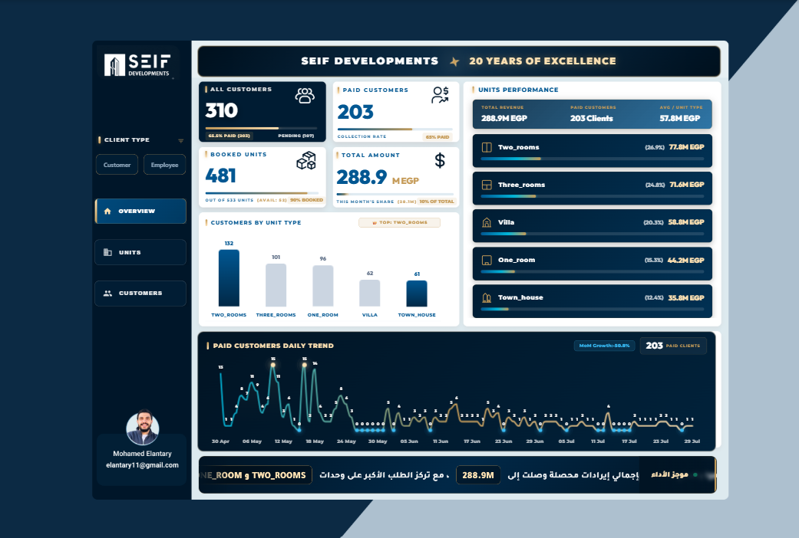
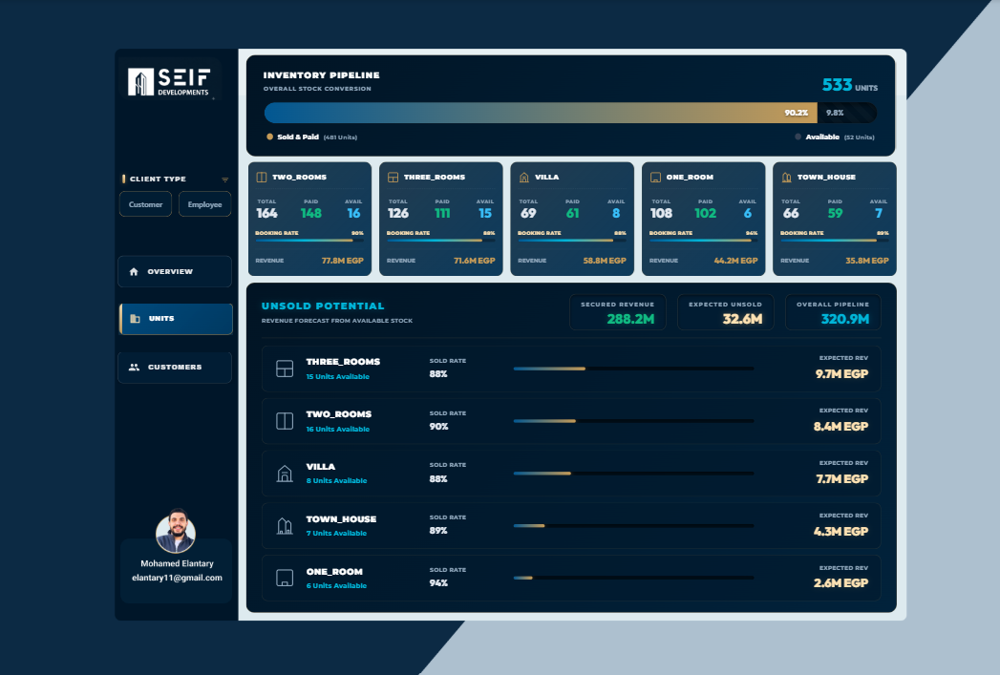
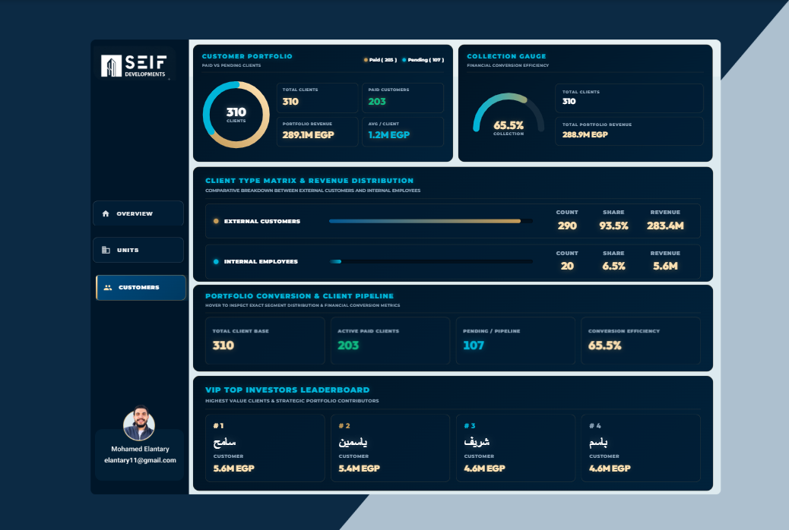

# Soly Vie Real Estate Analytics

I built this Power BI project to answer a simple question: is the development performing as well financially as the booking numbers suggest? The report brings property, booking, payment, and customer data together so management can see revenue, inventory, and collection performance in one place.

## Business problem

The booking rate looked strong, but it did not explain how much cash had been collected or what the remaining inventory was worth. I focused the analysis on four practical questions:

- How much revenue has been secured, and how much has actually been collected?
- Which unit types generate the most value?
- How much potential revenue remains in unsold inventory?
- Which customers and segments should receive collection or retention attention?

## Dashboard scope

The report is organized into three analytical views:

1. **Executive overview** - booking, customer, revenue, and collection KPIs.
2. **Inventory pipeline** - availability, booking rates, and unsold revenue potential by unit type.
3. **Customer portfolio** - paid versus pending customers, customer segments, and high-value accounts.

## Key metrics

| Metric | Value |
|---|---:|
| Total units | 533 |
| Booked units | 481 |
| Booking rate | 90.2% |
| Total customers | 310 |
| Paid customers | 203 |
| Secured revenue | 288.9M EGP |
| Collection rate | 65.5% |
| Estimated unsold potential | 32.6M EGP |

## Selected insights

- Two-room and three-room units contribute approximately 150M EGP, more than half of the secured revenue shown in the report. Town houses contribute 35.8M EGP.
- Despite the 90.2% booking rate, 52 units remain available and represent an estimated 32.6M EGP opportunity.
- The largest highlighted availability gap is in two-room units: 16 available units with approximately 8.4M EGP in potential revenue.
- The 65.5% collection rate leaves 107 contracts in the pending pipeline, showing a meaningful gap between booked revenue and collected cash.
- External customers contribute 283.4M EGP in the customer-type analysis, while the customer leaderboard supports targeted account management and retention programs.

## Business implications

- Prioritize marketing and inventory decisions around the unit types that combine high demand with strong revenue contribution.
- Convert the unsold-unit count into a monetary pipeline so management can set specific liquidation targets.
- Separate booked revenue from collected cash when assessing project performance.
- Use customer segmentation to prioritize collection follow-up and loyalty activity without exposing personally identifiable client information.

## Tools and techniques

- Microsoft Power BI
- Power Query
- DAX measures and KPI design
- Data cleaning and transformation
- Data modeling
- Business requirements analysis
- Dashboard design and data storytelling

## Gallery

### Inventory pipeline

### Customer portfolio

> Privacy note: the supplied customer view appears to contain individual client names. Replace them with anonymous labels before publishing the image or report publicly unless the data is demonstrably synthetic or you have permission to disclose it.

## Repository note

The repository includes the report export and dashboard images. The `.pbix` file and source data can be added separately when they are ready for public use.

## Author

Mohamed Elantary - Data Analyst and Data Engineering student  
[LinkedIn](https://www.linkedin.com/in/mohamed-elantary-data/) | [GitHub](https://github.com/elantary11)
